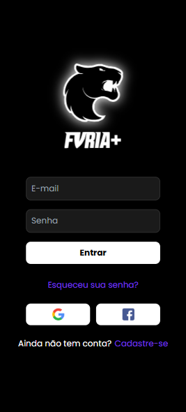
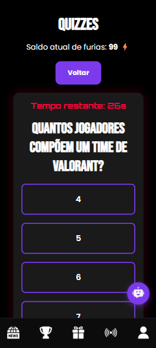

# ⚡ Furious App

Furious App is a mobile gamified prototipe platform designed to engage users with dynamic challenges, weekly rankings, and customizable profiles.

### Login Screen


### Home Screen


### Map Screen


### Missions Screen


## 🚀 Features

### 🔐 Authentication
- **Firebase Authentication**: Users can sign up or log in using Google, Facebook, or Email/Password.
- **Reauthentication**: For sensitive actions like account deletion, the app requires users to reauthenticate based on their login provider.

### 📸 Profile Customization
- Users can upload and crop a profile picture.
- Images are uploaded to **Firebase Storage**, and the download URL is saved both in **Redux** and Firebase.
- When the app is reloaded or the user logs in again, their profile picture persists.

### 📊 Weekly Rankings
- A fixed weekly ranking displays the top 5 users based on "Fúrias" (points).
- Visual rewards using emojis 🥇🥈🥉 for top-ranked users.

### 📁 Account Management
- Users can log out or delete their account.
- Account deletion is confirmed with a prompt and requires reauthentication for security.

## 🛠 Technologies Used

### Frontend
- **HTML/CSS/JavaScript**: For markup, styling, and interactions.
- **React.js**: SPA architecture and component-based UI.
- **React-Router**: Handles routing between pages like login, profile, and challenges.
- **Redux**: Manages user state globally, including authentication and profile image.
- **AOS.js (Animate on Scroll)**: Provides smooth scroll-based animations to enhance UI/UX.

### Backend and Storage
- **Firebase Authentication**: Manages user sign-in methods and authentication states.
- **Firebase Firestore**: Stores user data and app-related collections.
- **Firebase Storage**: Stores user-uploaded profile pictures with persistent URLs.

## 📂 Project Structure (Simplified)
```
/src
├── assets/                 # Images and icons
├── components/             # Shared components (e.g. buttons, cards)
├── pages/
│   ├── Login.jsx
│   ├── Profile.jsx         # Profile with image upload and account actions
│   └── Home.jsx
├── slices/
│   └── userSlice.js        # Redux slice for user management
├── App.js                  # Main app entry with routes
└── firebase.js             # Firebase config and exports
```

## 🧪 How to Run Locally

```bash
git clone https://github.com/yourusername/furious-app.git
cd furious-app
npm install
npm start
```

Ensure you configure your own Firebase project and replace the credentials in `firebase.js`.

## 🧠 Future Improvements
- Real-time ranking updates from Firestore
- Chat feature for users
- Enhanced analytics dashboard for admins
